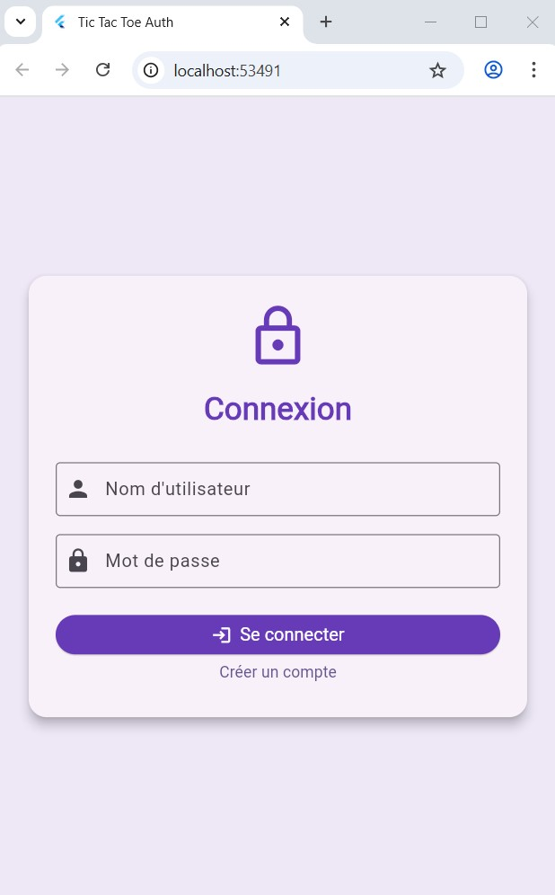
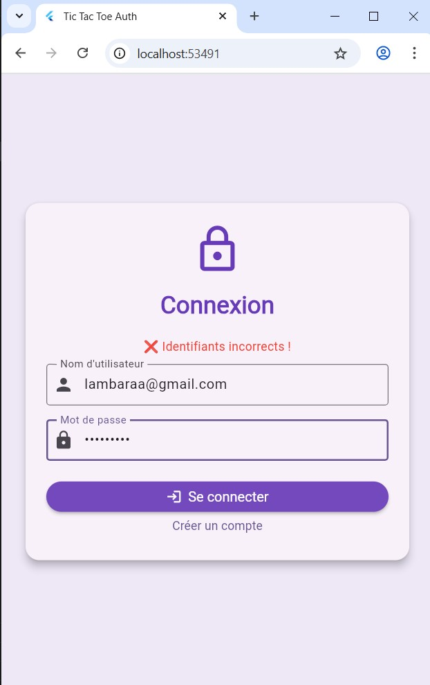
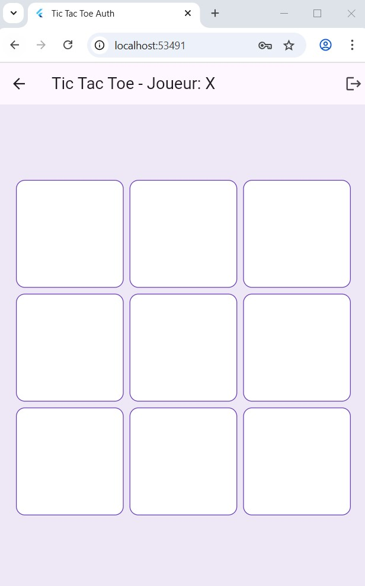

# 🎮 Flutter Tic Tac Toe Auth App – BDCC Mobile UI Showcase

Une application mobile Flutter simple mais complète développée pour le module BDCC.  
Elle démontre l'intégration de **l'authentification locale** combinée à un **jeu de Tic Tac Toe** avec une interface moderne.

---

## ✨ Fonctionnalités

- 🔐 **Connexion / Inscription sécurisée** avec `SharedPreferences`
- 💾 **Connexion persistante** entre les sessions
- 🔓 **Déconnexion** disponible dans l'écran du jeu
- 🎮 **Logique du jeu Tic Tac Toe** avec détection de victoire ou égalité
- 🪄 **Popup Résultat** pour afficher le gagnant ou l'égalité
- 🧼 **Design moderne** avec `Card`, `Icons`, `Colors.deepPurple`

---

## 📸 Captures d'écran

| Connexion | Erreur | Inscription |
|-----------|--------|-------------|
|  |  |  |

| Plateau Vide | Résultat - Gagné |
|--------------|------------------|
|  |  |

---

## 🗂 Structure du projet

```
lib/
├── main.dart
├── screens/
│   ├── splash_screen.dart
│   ├── login_screen.dart
│   ├── signup_screen.dart
│   └── game_screen.dart
├── services/
│   └── auth_service.dart
```

---

## 🔐 Authentification locale

- Stockage sécurisé des identifiants avec `SharedPreferences`
- Redirection automatique via `SplashScreen`
- Vérification simple : `username + password` enregistrés localement

---

## 🚀 Lancer le projet

```bash
flutter clean
flutter pub get
flutter run -d chrome
```

✅ Compatible Web, Android et émulateur

---

## 👨‍💻 Réalisé par

**Abdellah Lambaraa**  
Projet Flutter – II-BDCC 2025  
Licence Open Source (libre d'utilisation et de partage)